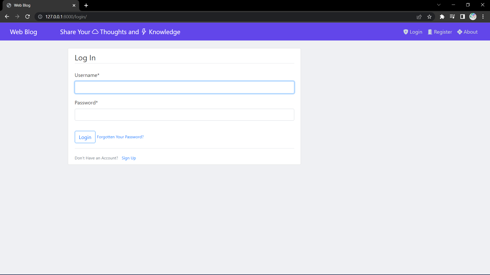
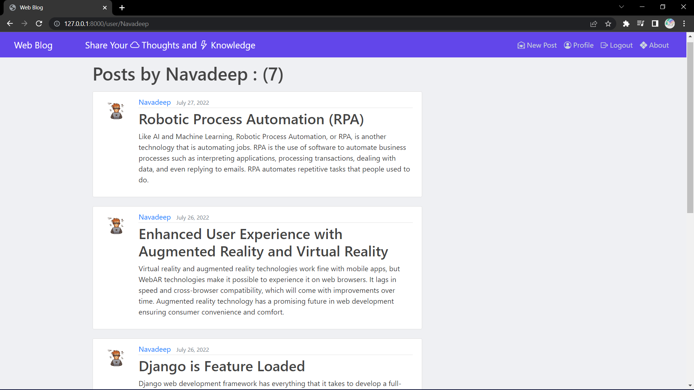

<h1>DJANGO-WEB BLOG</h1>

Django Web blog is the user friendly blogpost application which has complete user authentication system where it gives the users to register themselves and login through there registered credintials, later they even update there profile by changing there profile image, Email, & username. It also gives the users to reset there password by through Email.

Users can share there Thoughts, Knowledges and Idealogies through posts and can later update them with latest info, delete the post if the want to do. This was done by class based views and by the creation of models 

Here are some screenshots of the prooject

<h1>Home Page</h1>

<h1>Login Page</h1> 

<h1>Login Page</h1> 

<h1>Register Page</h1>

<h1>password Reset Page</h1>

<h1>Reset Mail Success</h1>

<h1>Reset Mail </h1>

<h1>Newpassword Page</h1>

<h1>Reset Success Page</h1>

<h1>Home Page After Login</h1>

<h1>Profile Page</h1>

<h1>Home Page</h1>

<h1>Particular user posts</h1>

<h1>Particular another user posts</h1>

<h1>New Post</h1>

<h1>Post Update and Delete</h1>

<h1>Pagination</h1>

<h1>Logout page</h1>

 

