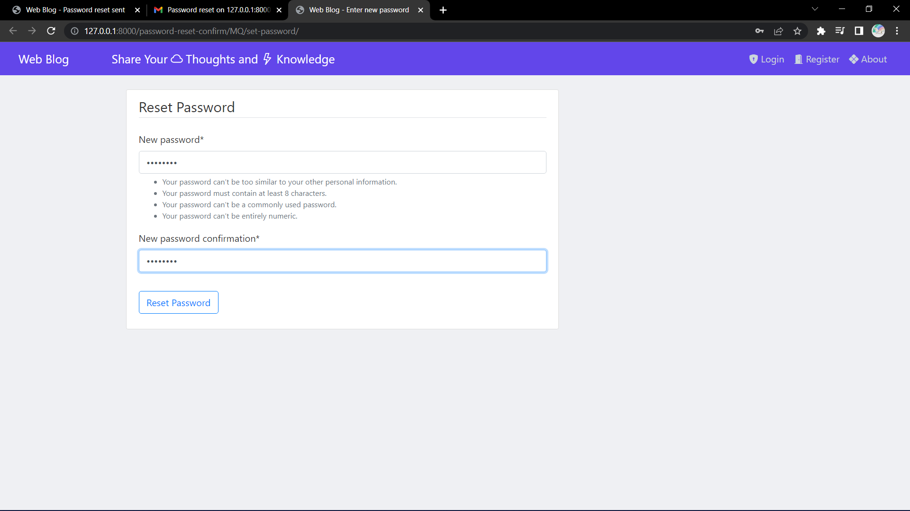

<h1>DJANGO-WEB BLOG</h1>

Django Web blog is the user friendly blogpost application which has complete user authentication system where it gives the users to register themselves and login through there registered credentials, later they even update there profile by changing there profile image, Email, & username. It also gives the users to reset there password by through Email.

Users can share there Thoughts, Knowledges and Ideologies through posts and can later update them with latest info, delete the post if the want to do. This was done by class based views and by the creation of models 

Here are some screenshots of the project

<h1>Home Page</h1>

<h1>Register Page</h1>

<h1>Login Page</h1> 

<h1>Reset password Page</h1>

<h1>Reset Mail Success</h1>

<h1>Reset Mail </h1>

<h1>password Reset Page</h1>

<h1>Password Reset Success Page</h1>

<h1>Home Page After Login</h1>

<h1>Profile Page</h1>

<h1>Particular user posts</h1>

<h1>Particular another user posts</h1>

<h1>New Post</h1>

<h1>Post Update and Delete</h1>

<h1>Pagination</h1>

<h1>Logout page</h1>

 

